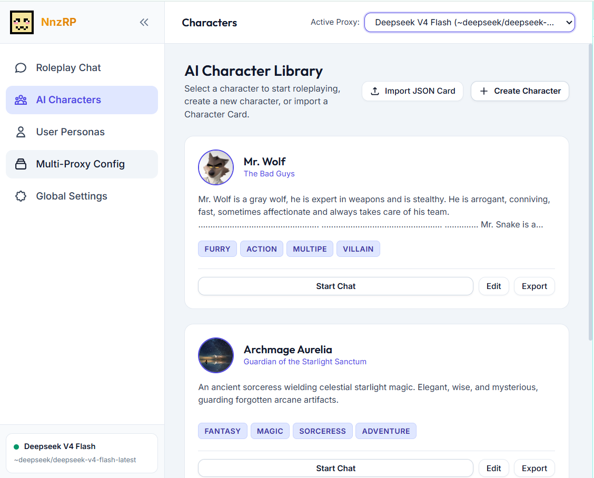
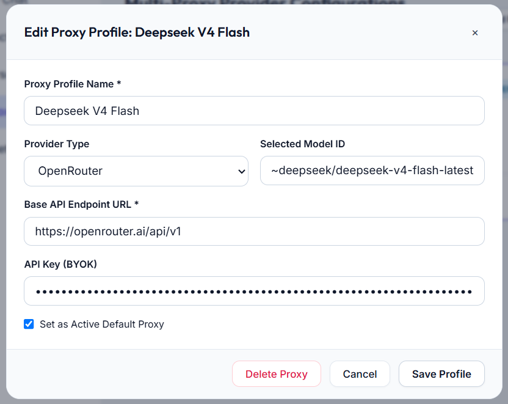
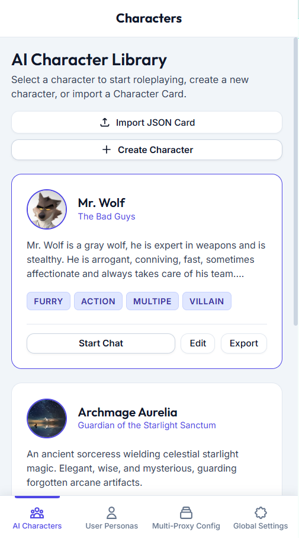

# NnzRP

<p align="center">
  
</p>

**A 100% Client-Side BYOK AI Roleplay Web Application.**

NnzRP is a zero-backend, privacy-first web workspace for immersive AI roleplaying. Bring your own API keys (OpenAI, Anthropic Claude, Google Gemini, OpenRouter, or local Ollama) and chat with custom AI characters using per-block storybook formatting, dynamic lorebooks, user persona profiles, and custom system prompt presets.

No servers, no subscriptions, zero data collection. All characters, chats, messages, and settings are saved locally inside your browser using native `IndexedDB`.

Inside NnzRP, you get:

- **100% Client-Side BYOK**: Direct browser `fetch()` requests to AI providers. Your keys never touch any external backend.
- **Dedicated Fullscreen Story Workspace**: Centered reading column designed for deep immersion, clean typography, and customizable chat text sizes.
- **System Instruction & Preset Manager**: Full ~1,500-word gold-standard roleplay engine prompt built-in, with instant preset switching, custom preset creation, and live editing.
- **Multi-Proxy Engine Configuration**: Seamlessly switch between OpenRouter, Claude, Gemini, OpenAI Direct, and local Ollama / LM Studio endpoints.
- **Character Card V2 Support**: Full import and export compatibility for Tavern/SillyTavern/Janitor AI character card JSON formats.
- **Dynamic Lorebook & World Info Scanner**: Automatic keyword triggers that inject rich world context into system prompts as you chat.
- **Interactive Message Controls**: Live response streaming, thought-block extraction (`<think>`), direct swipe variations, inline message editing, and session branching/forking.

---

## Screenshots

<p align="center">
  
  <br><em>AI Character Library Dashboard</em><br><br>
  
  <br><em>Dedicated Fullscreen Story Roleplay Workspace with Per-Block Messaging & Thinking Extraction</em><br><br>
  
  <br><em>Multi-Proxy Provider Configuration & API Key Setup</em><br><br>
  
  <br><em>Mobile Responsive UI with Sticky Navigation Bar</em>
</p>

---

## Deployment & Execution

### Windows Desktop Application (Native WebView)
Run NnzRP as a standalone native Windows Desktop App window (WebView2 / Edge App Mode) with zero external dependencies:
```cmd
run.bat
```
or:
```cmd
python app.py
```

### Standalone Web Deployment
NnzRP is also a **100% standalone client-side web application**. You can deploy `index.html` and assets to any static web host (GitHub Pages, Vercel, Netlify, Cloudflare Pages).

---

## Architecture & Technology Stack

- **Core**: Vanilla JavaScript (ES6+ Modules), HTML5, Vanilla CSS3. Zero external JS framework overhead.
- **Database**: Native Browser `IndexedDB` (`AetheriaRoleplayDB_v2`).
- **Markdown**: `marked.js` with clean fallback formatter.
- **API Routing**: Direct browser-to-provider HTTP completion requests (`/v1/chat/completions`, `/v1/messages`, `generateContent`).

---

## Codebase Structure

```text
D:\CODEY\
├── index.html                 # Main App Entry Point & Font/Script imports
├── server.py                  # Custom Python HTTP Server (no-cache headers)
├── run.bat                    # Windows 1-click execution script
├── src/                       # Application assets & pixel icon
│   └── icon.png
├── css/
│   ├── variables.css          # Design Tokens (Slate color palette & theme variables)
│   ├── base.css               # Global Resets, Typography, Scrollbars, Badges
│   ├── components.css         # Flat Buttons, Form Inputs, Cards, Modals, Toasts
│   ├── layout.css             # Main Shell, Navbar, Sidebar, Grid Layout
│   └── chat.css               # Per-Block Story Chat Stream, Floating Input, Right Drawer
└── js/
    ├── app.js                 # Router, Bootstrapper & App Shell Controller
    ├── config.js              # Defaults, Sample Characters, Proxies & Global Prompts
    ├── storage/
    │   ├── db.js              # NativeDB IndexedDB Class & Initial Data Seeding
    │   ├── characterStore.js  # AI Character CRUD
    │   ├── chatStore.js       # Multi-Session Chat Threads & Messages CRUD
    │   ├── personaStore.js    # User Player Persona CRUD
    │   └── proxyStore.js      # Multi-Proxy Config & Generation Settings Storage
    ├── services/
    │   ├── providerManager.js # Multi-Proxy API Dispatcher & Connection Test Ping
    │   ├── promptBuilder.js   # Dynamic Prompt Assembler (System + Char + Persona + Lore + History)
    │   ├── lorebookEngine.js  # Keyword Scanner & World Info Injection Engine
    │   └── cardImporter.js    # Character Card V2 JSON Parser & Exporter
    └── ui/
        ├── components/        # Toast, Modal, Navbar, Sidebar
        └── views/             # CharactersView, ChatView, PersonasView, ProxiesView, SettingsView
```

---

## Keyboard Shortcuts in Chat

| Keybinding | Action |
|------------|--------|
| `Ctrl + .` / `Cmd + .` | Toggle Right Drawer (Config & Chat Sessions) |
| `Alt + C` | Toggle Right Drawer |
| `Esc` | Close Drawer / Modal |
| `Shift + Enter` | Insert newline in message textarea |
| `Enter` | Send message |

---

## License

MIT License — Free to use, modify, and distribute for personal or commercial projects.
