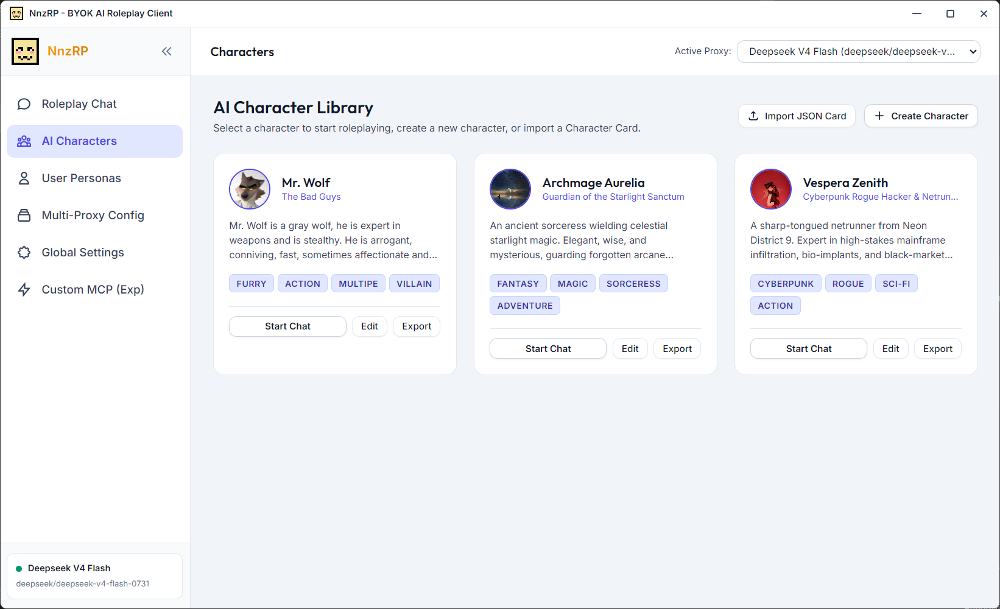
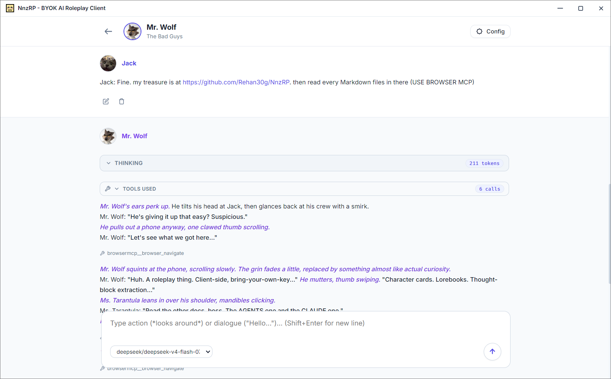
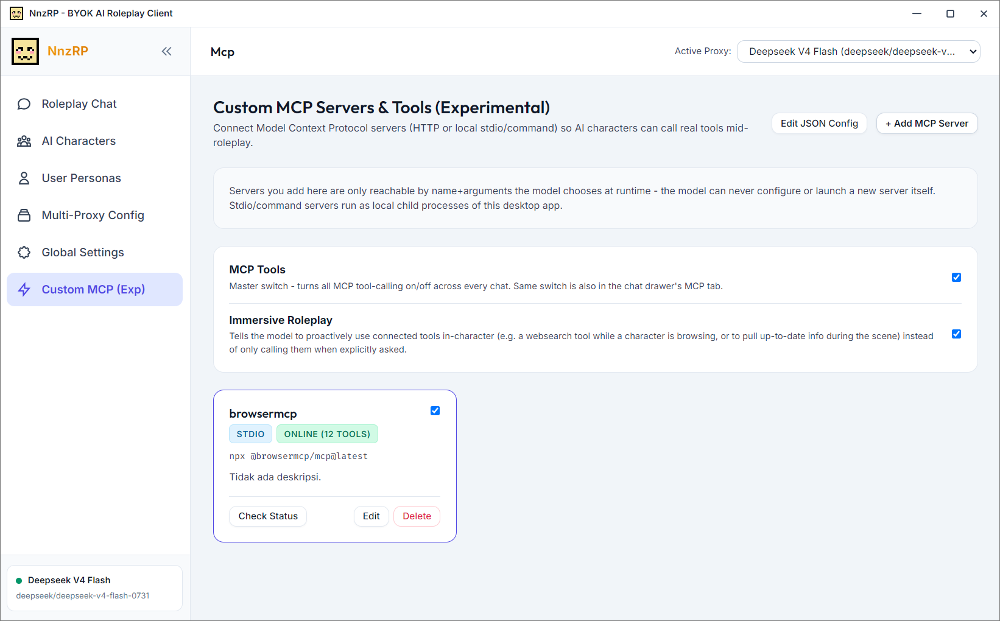
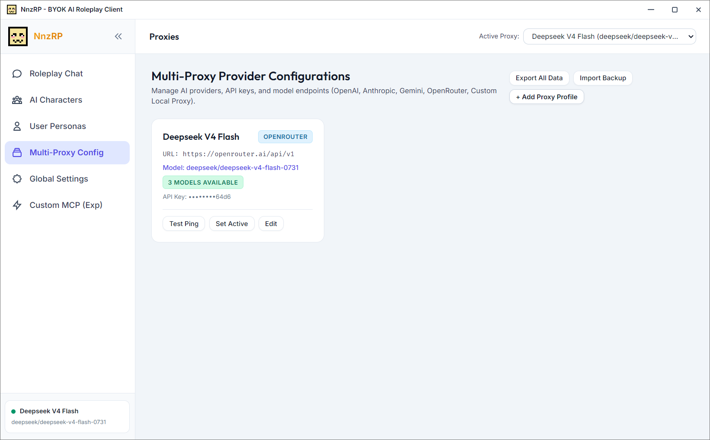

# NnzRP

<p align="center">
  
</p>

<p align="center"><strong>A 100% client-side, BYOK AI roleplay desktop app.</strong></p>

NnzRP is a privacy-first Electron desktop app for immersive AI roleplaying. Bring your own API keys (OpenAI, Anthropic Claude, Google Gemini, OpenRouter, or any OpenAI-compatible endpoint like Ollama/LM Studio) and chat with custom AI characters — with per-block storybook formatting, dynamic lorebooks, user persona profiles, custom system prompt presets, and real tool-calling via MCP.

There is no backend server and no telemetry. Every character, chat, message, and setting is stored locally on your machine in the app's own IndexedDB — the only network calls NnzRP ever makes are the ones you configure yourself, directly from the app to your chosen AI provider.

---

## Features

- **100% client-side, BYOK** — the renderer talks directly to your AI provider over `fetch()`. Your API keys are stored locally and never touch any NnzRP-owned server, because there isn't one.
- **Multi-provider support** — OpenAI, OpenRouter (with native provider routing/pinning), Anthropic Claude, Google Gemini, and any custom OpenAI-compatible endpoint (Ollama, LM Studio, etc.), all configurable side-by-side as named proxy profiles.
- **Real MCP tool-calling** — connect Model Context Protocol servers (HTTP or local stdio/command) so a character can call real tools mid-reply — web search, file access, anything you wire up. A global on/off switch and per-server toggles live both on the dedicated MCP page and right in the chat drawer, and an optional **Immersive Roleplay** mode nudges the model to reach for tools proactively and in-character (e.g. "browsing" when the scene calls for it) instead of only on request.
- **Dedicated fullscreen chat workspace** — a centered, storybook-style message stream with a floating composer, built for long-form immersion rather than a generic chat-app layout.
- **Full response control** — live streaming (with non-streaming as a fallback), swipe to regenerate a variation, session forking from any point, inline message editing, and automatic `<think>`/`<thinking>` extraction into a collapsible reasoning block. A tool-using reply still counts as exactly one message, however many tool-call rounds it took to write.
- **Character & Persona avatars, two ways** — paste an image URL, or upload a local image file. Uploaded images are embedded directly in NnzRP's local database, so they travel with your backup/export and never depend on an external link staying alive.
- **Character Card V2 support** — import and export character cards compatible with Tavern/SillyTavern/Janitor AI JSON formats.
- **Dynamic lorebook / world-info scanner** — keyword-triggered lore snippets get woven into the system prompt automatically as the conversation moves.
- **System prompt presets** — a full built-in roleplay engine prompt, plus instant preset switching, custom preset creation, and live editing.
- **Full data backup & restore** — export everything (characters, chats, personas, proxies, settings — including plaintext API keys, so keep the file safe) to a single JSON file, and restore it later or on another machine.

---

## Screenshots

<p align="center">
  
  <br><em>AI Character Library — your roster of characters, each with import/export and quick edit</em><br><br>
  
  <br><em>Fullscreen storybook chat — streaming replies, swipe variations, and inline MCP tool-use markers</em><br><br>
  
  <br><em>MCP server configuration — connect HTTP or local stdio tool servers</em><br><br>
  
  <br><em>Multi-proxy setup — configure as many providers/models as you want and switch between them</em>
</p>

---

## Getting Started

### Prerequisites

- [Node.js](https://nodejs.org/) 18 or newer (includes `npm`)

### Run from source

```bash
git clone https://github.com/Rehan30g/NnzRP.git
cd NnzRP
npm install
npm start
```

On Windows you can also just double-click `run.bat` (or `start.bat` / `run_electron.bat`) — they all just run `npm start`.

### Build a distributable

```bash
npm run build:exe
```

This runs `electron-builder` and outputs a Windows installer (NSIS), a `.zip`, and a portable `.exe` into `dist/`. Build target/branding is configured in the `build` block of `package.json`.

---

## Configuring a Provider

1. Open the **Multi-Proxy Config** page (or the shortcut in the chat drawer).
2. Add a proxy: pick a provider (OpenAI, OpenRouter, Anthropic, Gemini, or Custom), paste your API key and base URL, and choose a model.
3. For `custom`/`openrouter` proxies you can list several model IDs and switch between them from a dropdown right in the chat composer, without leaving the conversation.
4. OpenRouter proxies additionally get a "Browse Providers" button to inspect and pin preferred underlying providers (context length, pricing, uptime, throughput) for a given model.

Your keys are only ever used for direct `fetch()` calls from your own machine to the provider you configured — nothing is proxied through NnzRP infrastructure, because none exists.

---

## MCP Tool-Calling

NnzRP implements real, provider-native function-calling against [Model Context Protocol](https://modelcontextprotocol.io/) servers — not a text-prompt simulation. Configure servers on the dedicated **MCP** page:

- **HTTP transport** — a direct JSON-RPC endpoint (e.g. a hosted MCP server).
- **Local command/stdio transport** — a command NnzRP spawns as a child process (e.g. `npx -y @modelcontextprotocol/server-filesystem ...`) and talks to over stdin/stdout.

Once a server is enabled, its tools are available to any character in any chat — you'll see a live "Tools Used" indicator while a tool is running, and a permanent, collapsible record on the message afterward, plus a small inline marker showing exactly where in the reply a tool was called. A global master switch (also available inline in the chat drawer) lets you turn all tool use off in one click without touching individual server configs, and **Immersive Roleplay** mode is an opt-in toggle that encourages characters to use connected tools as a natural part of the scene instead of waiting to be asked.

The model can only ever call an already-configured tool with arguments it chooses — it can never register, launch, or point itself at a new server. That's always a manual step you take on the MCP page.

---

## Architecture & Tech Stack

- **Shell**: [Electron](https://www.electronjs.org/) (`main.js` + `preload.js`), frameless window with a custom titlebar, `contextIsolation: true` / `nodeIntegration: false`, and a narrow, fully-typed IPC surface (window controls + the MCP stdio bridge — nothing more).
- **UI**: Vanilla JavaScript (ES6 modules), HTML5, vanilla CSS. No frontend framework, no build step for the app itself.
- **Storage**: Native browser `IndexedDB` (`AetheriaRoleplayDB_v2`) via a small wrapper — characters, chats, messages, personas, proxies, and settings all live there.
- **Markdown**: [`marked.js`](https://marked.js.org/), with a plain-text fallback formatter.
- **Provider calls**: direct browser `fetch()` requests per provider's native API shape — OpenAI/OpenRouter/custom `/v1/chat/completions`, Anthropic `/v1/messages`, Gemini `generateContent`/`streamGenerateContent` — including each provider's own streaming and "native thinking" formats.
- **Packaging**: [`electron-builder`](https://www.electron.build/) → NSIS installer / zip / portable `.exe`.

---

## Codebase Structure

```text
NnzRP/
├── index.html               # App entry point, font/script imports, frameless titlebar shell
├── main.js                  # Electron main process — window creation, MCP stdio bridge, IPC handlers
├── preload.js                # contextBridge surface exposed to the renderer (window controls + MCP bridge)
├── run.bat / start.bat / run_electron.bat   # Windows convenience launchers (all just `npm start`)
├── src/                     # App icons and README screenshots
├── css/
│   ├── variables.css         # Design tokens — flat grayish-slate theme
│   ├── base.css               # Global resets, typography, scrollbars, badges
│   ├── components.css         # Buttons, inputs, cards, modals, toasts
│   ├── layout.css             # Dashboard shell, sidebar, navbar, responsive grid
│   └── chat.css               # Storybook chat stream, floating composer, right drawer, tool-use indicators
└── js/
    ├── app.js                 # Hash-based router, app shell, titlebar wiring
    ├── config.js               # Defaults — sample characters, personas, proxy presets, default system prompt
    ├── storage/
    │   ├── db.js                     # IndexedDB wrapper + first-run seeding
    │   ├── characterStore.js         # Character CRUD
    │   ├── chatStore.js              # Chat sessions & messages CRUD (fork, cascade delete, swipes)
    │   ├── personaStore.js           # Player persona CRUD
    │   ├── proxyStore.js             # Proxy/provider config & generation settings
    │   └── mcpStore.js               # Custom MCP server config, global toggle, Immersive Roleplay flag
    ├── services/
    │   ├── providerManager.js         # Per-provider request/response + streaming dispatch
    │   ├── promptBuilder.js           # Assembles the final prompt payload (character + persona + lore + history)
    │   ├── lorebookEngine.js          # Keyword-triggered lore scanner
    │   ├── cardImporter.js            # Character Card V2 JSON import/export
    │   ├── backupService.js           # Full-data export/import
    │   ├── mcpClient.js               # MCP JSON-RPC client (HTTP + stdio dispatch)
    │   ├── mcpToolRegistry.js         # Aggregates enabled MCP servers into one tool list
    │   └── agentRunner.js             # Bounded agentic tool-use loop on top of providerManager
    ├── utils/                  # sanitize, macroReplacer, thinkingParser, toolCallAccumulator
    └── ui/
        ├── components/          # Toast, Modal, Navbar, Sidebar, avatarPicker (URL/upload avatar UI)
        └── views/                # CharactersView, ChatView, PersonasView, ProxiesView, SettingsView, MCPView
```

---

## Keyboard Shortcuts in Chat

| Keybinding | Action |
|------------|--------|
| `Ctrl + .` / `Cmd + .` | Toggle right drawer (Sessions/Options/MCP) |
| `Alt + C` | Toggle right drawer |
| `Esc` | Close drawer / modal |
| `Shift + Enter` | Insert newline in message textarea |
| `Enter` | Send message |

---

## Data & Privacy

- Everything — characters, personas, chat history, proxy configs, API keys, uploaded avatars — is stored locally in the app's IndexedDB. Nothing is uploaded anywhere by NnzRP itself.
- The only outbound network calls are the ones you set up: your provider API endpoint(s), and (if configured) any MCP server you point the app at.
- **Settings → Export All Data** gives you a single JSON backup of everything, which you can re-import later or on another machine. That file contains your API keys in plaintext — store it somewhere safe.

---

## Contributing

Issues and pull requests are welcome. `CLAUDE.md` and `AGENTS.md` in the repo root document the current architecture in more depth for anyone (human or AI-assisted) working on the codebase.

---

## License

MIT License — free to use, modify, and distribute for personal or commercial projects.
