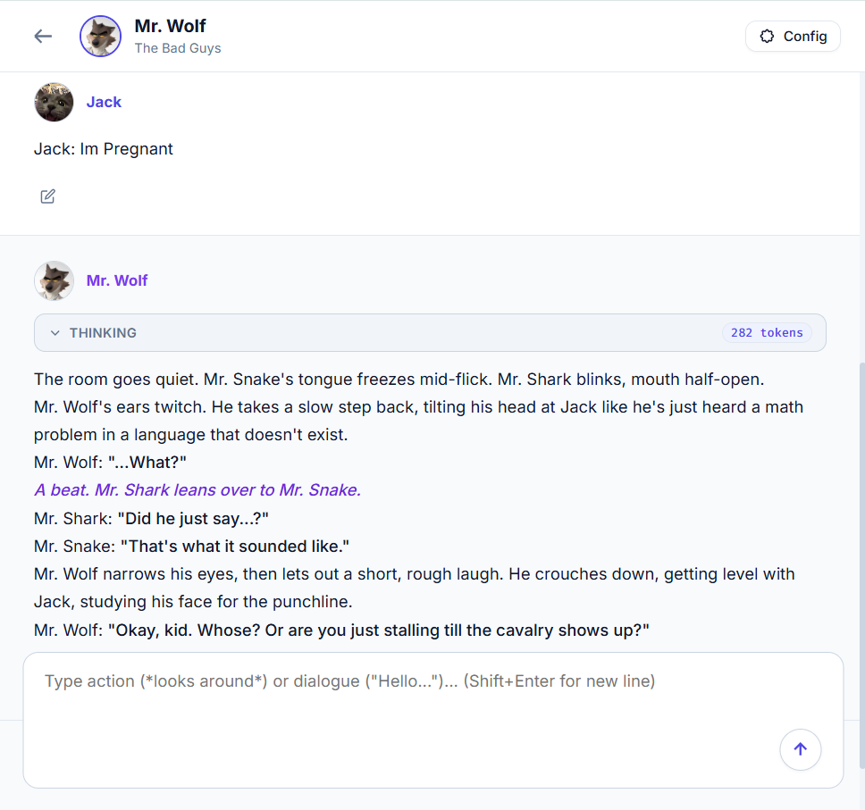
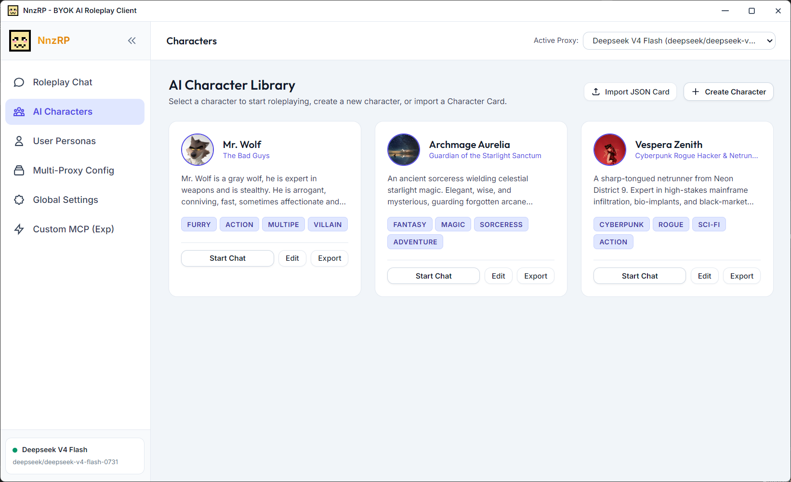
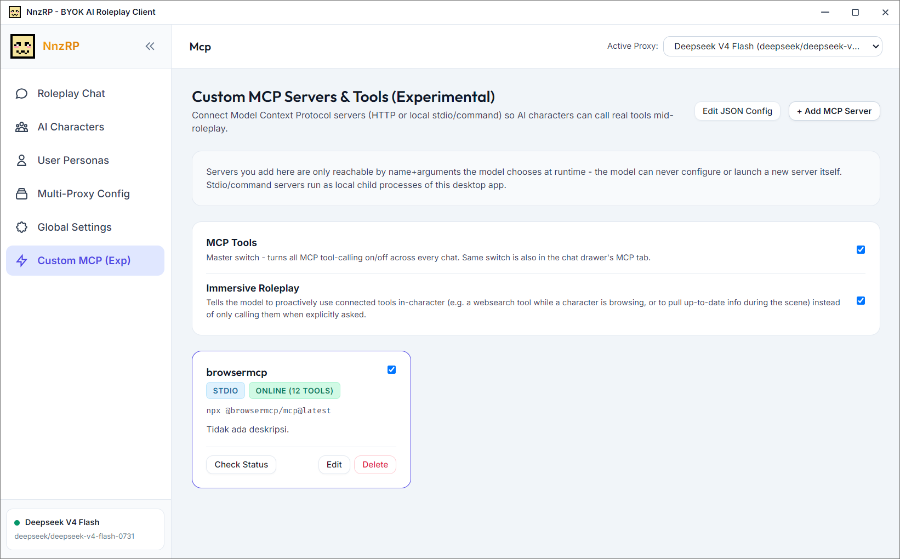
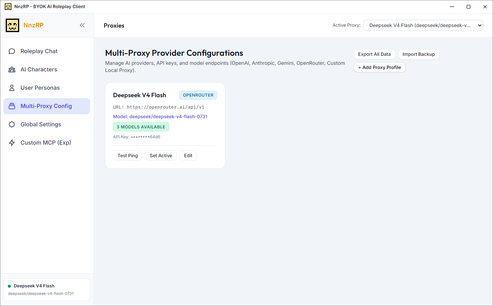

<div align="center">


# NnzRP

### Roleplay with AI characters who can actually go look things up.

A roleplay app that runs entirely on your device. Bring your own API key, pick your characters, and start chatting.<br>
No account, no server in the middle, no tracking.

<br>

[](LICENSE)
[](#-get-the-app)
[](#-characters-that-can-use-tools)

<br>



</div>

---

## 👋 What is this?

NnzRP is a place to chat and roleplay with AI characters, using whichever AI provider you already have a key for. Your characters, chats, and keys stay on your own device.

What makes it a bit different: characters can use real tools while staying in the scene. Ask one to check a website and they'll actually open it, read it, and react to what they found, all inside the story.

---

## 🛠️ Characters that can use tools

In the screenshot above, Mr. Wolf is handed a GitHub link. He doesn't stop the scene to say "calling a tool now". He just pulls out his phone:

> *He pulls out a phone anyway, one clawed thumb scrolling.*
>
> **Mr. Wolf:** "Let's see what we got here..."
>
> &nbsp;&nbsp;&nbsp;&nbsp;<sub>`browsermcp__browser_navigate`</sub>
>
> *Mr. Wolf squints at the phone, scrolling slowly. The grin fades a little, replaced by something almost like actual curiosity.*
>
> **Mr. Wolf:** "Huh. A roleplay thing. Client-side, bring-your-own-key..."

He really did read the page. Here's how that works for you:

- **Several steps in one reply.** A character can use a few tools in a row before answering, so they can look around properly instead of guessing.
- **One clean message.** What they say before, during, and after looking something up all ends up in a single reply, like a person telling you what they did.
- **Small markers in the text.** A little tag shows exactly where in the reply a tool was used. Tap the "Tools Used" chip if you want the full details.
- **You stay in control.** Every tool asks for your permission first. You can allow it once, always allow it, or block it. There's also one switch to turn all tools off.
- **Optional "stay in character" nudge.** Turn on Immersive Roleplay and characters will reach for tools on their own when the scene calls for it, not only when you ask.

Tools come from [MCP servers](https://modelcontextprotocol.io/), which you add yourself. They can be online (HTTP) or, on the Windows app, a program running on your PC.

### Built-in tools (no setup needed)

| Tool | What it does |
|---|---|
| **Look at an image** | Give a character an image link and they'll actually see it. Shows up automatically when your model supports images. |
| **Show HTML** | Lets a character draw a small chart, animation, or clickable choices right inside the chat. |
| **Wait** | Lets a character pause for a moment (up to 30 seconds) for pacing in a scene. |

> [!WARNING]
> **Show HTML** and **Wait** are off until you turn them on in the Custom MCP page. Show HTML runs code written by the AI inside a locked box with no internet access. It's safe by design, but only turn it on if you're comfortable with that.

---

## ✨ Everything else

| | |
|---|---|
| 🔑 **Your own keys** | Save as many providers as you like and switch between them, even in the middle of a chat. |
| 📖 **Comfortable chat** | Live typing, regenerate a reply with a swipe, branch a chat from any point, edit any message. |
| 🖼️ **Send pictures** | Attach images when your model can see them. |
| 📏 **Long chats that don't fall apart** | A meter shows how full the model's memory is. When it gets tight, older parts of the chat get summarized so the story keeps going. |
| ⏳ **Type while it replies** | Your next message waits in line and sends itself when the reply finishes. |
| 🃏 **Character cards** | Import and export cards that work with SillyTavern, Tavern, and Janitor AI. |
| 👤 **Characters and personas** | Avatars from a link or your gallery, lorebooks that kick in on keywords, and saved system prompts. |
| 🎨 **Light or dark** | Follow your system, or pick one. Choose your own accent color too. |
| 💾 **Backup** | Save everything to one file and load it back on any device. |
| 📱 **Made for phones too** | Big tap targets, swipe between tabs, and menus that slide up from the bottom. |
| 🔌 **Plugins (Windows)** | Add extra features without touching the app, like a voice plugin that reads replies out loud. |

<div align="center">

**Works with**


<sub>Plus any service that works like the OpenAI API.</sub>

</div>

---

## 📥 Get the app

Same app, three ways to use it.

| | |
|---|---|
| 🌐 **Browser** | Open **[rehan30g.github.io/NnzRP](https://rehan30g.github.io/NnzRP/)**. You can also use your browser's *Install app* option to put it on your home screen. |
| 🤖 **Android** | Download the APK from the **[latest release](https://github.com/Rehan30g/NnzRP/releases/latest)** and install it. Most updates arrive on their own the next time you open the app. |
| 🪟 **Windows** | Get the installer or the portable `.exe` from the same **[latest release](https://github.com/Rehan30g/NnzRP/releases/latest)**. The installer version updates itself. The portable one doesn't, so grab a new copy when you want to update. |

> [!NOTE]
> MCP servers that run as a program on your PC only work in the Windows app. On the browser and Android, use online (HTTP) MCP servers instead.

<details>
<summary><b>Run it from the source code</b></summary>

<br>

You'll need [Node.js](https://nodejs.org/) 18 or newer.

```bash
git clone https://github.com/Rehan30g/NnzRP.git
cd NnzRP
npm install
npm start
```

On Windows you can also just double-click `run.bat`.

Other handy commands:

```bash
npm run serve       # run the browser version locally
npm run build:exe   # build the Windows installer and portable .exe into dist/
```

</details>

---

## 🚀 Getting started

**1. Add your AI provider.**
Go to **Settings → Proxies**, add a profile, choose your provider, then paste your API key and model name.

- You can save several models in one profile and switch between them from the chat box.
- OpenRouter users get a **Browse Providers** button to pick which hosts serve your model, with price and speed shown.

**2. Pick a character and start chatting.**
Two sample characters are ready to go, or import your own card.

**3. Add tools (optional).**
Open the **Custom MCP** page and add a server. On Windows, that can be a command like:

```bash
npx -y @modelcontextprotocol/server-filesystem /your/folder
```

You can turn servers on and off from the chat side panel any time.

> [!IMPORTANT]
> The AI can only use tools **you** added. It can't add new ones by itself, and every tool asks you first until you say otherwise.

> [!TIP]
> Some models are much better at using tools than others. If a character keeps pretending to use a tool without actually doing it, try a different model.

---

## 📸 More screenshots

<details>
<summary><b>Character library, MCP servers, and provider setup</b></summary>

<br>
<div align="center">


<br><sub><em>Your character library</em></sub>
<br><br>


<br><sub><em>Tool servers, with permissions for each tool</em></sub>
<br><br>


<br><sub><em>Provider setup, found under Settings → Proxies</em></sub>

</div>
</details>

---

## ⌨️ Keyboard shortcuts

| Keys | What it does |
|---|---|
| <kbd>Ctrl</kbd>/<kbd>Cmd</kbd> + <kbd>.</kbd> or <kbd>Alt</kbd> + <kbd>C</kbd> | Open or close the side panel |
| <kbd>Esc</kbd> | Close the side panel or a popup |
| <kbd>Enter</kbd> | Send |
| <kbd>Shift</kbd> + <kbd>Enter</kbd> | New line |

---

## 🔒 Your data

Everything you make in NnzRP (characters, personas, chats, API keys, images) is saved on your own device. Nothing is uploaded anywhere. The app only talks to the AI providers, tool servers, and image links you choose.

> [!WARNING]
> The backup file from **Settings → Data → Export All Data** includes your API keys as plain text. Keep it somewhere private.

---

## 🧰 Under the hood

Plain JavaScript, no framework and no build step. The Windows app uses [Electron](https://www.electronjs.org/), the Android app uses [Capacitor](https://capacitorjs.com/), and the browser version works as an installable web app. Everything is stored in the browser's own database (IndexedDB).

---

## 🤝 Contributing

Bug reports and pull requests are welcome. If you're changing code, read [`CLAUDE.md`](CLAUDE.md) first. It explains how the app is put together.

---

<div align="center">

**MIT License**

<sub>Made by <a href="https://github.com/Rehan30g">Rehan</a></sub>

</div>
